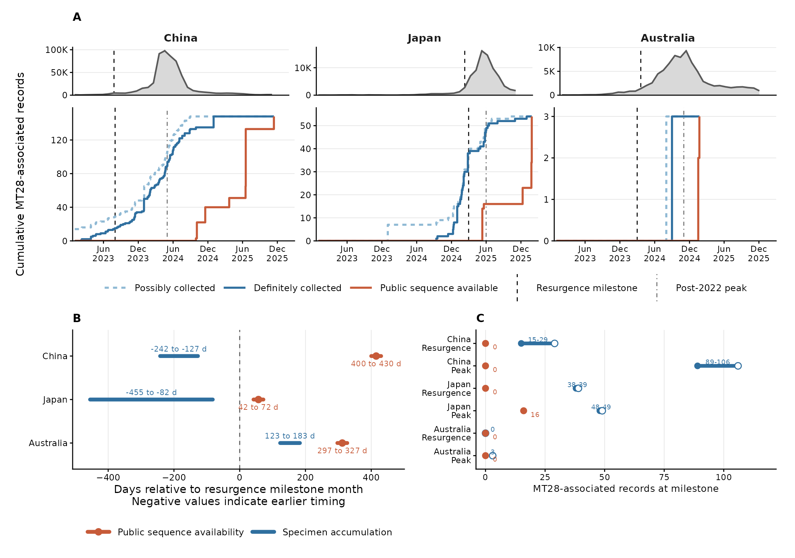

# Collection and public-archive timing during pertussis resurgence

This package supports the EID Dispatch, **“Public-Archive Timing for
MT28-Associated Pertussis Genomes, Australia, China, and Japan, 2023–2025.”**
It adds a public-availability layer to the frozen
989-genome tree and the fixed `L1_02.07` MT28-associated genomic-lineage
assignment. It does not rebuild the tree, redefine lineages, or refit the
transmission model.

## Analysis question

For each country, when had specimens later assigned to the target lineage been
collected, and when did the public archive contain the corresponding number of
genomes? Collection dates are interval-censored. Public dates are the earliest
reproducible ENA first-public or NCBI assembly-release date and represent an
optimistic earliest opportunity for external identification, not a documented
local alert or real-time lineage call.

The selected thresholds are five genomes for China and Japan and three for
Australia, where only three resurgence target-lineage genomes were present in
the frozen cohort.

## Main results

| Country | Collection detection interval | Public detection date | Public-minus-collection displacement |
|---|---|---|---|
| China | 2023-01-01 to 2023-03-27 | 2024-10-04 | 557–642 days |
| Japan | 2024-01-01 to 2024-12-09 | 2025-05-12 | 154–497 days |
| Australia | 2024-08-01 to 2024-08-31 | 2025-01-22 | 144–174 days |

Median accession-level collection-to-public lags were 398–446 days in China,
249.5–261 days in Japan, and 138–168 days in Australia. These intervals do not
estimate sequencing, analysis, or operational reporting delays because those
dates were unavailable at accession level.

[](figures/eid/Figure_1_release_clock_pertussis_eid.pdf)

## Package map

| Component | Contents |
|---|---|
| `data/derived/public_genome_availability.tsv` | Accession-level collection bounds, public routes, geography, lineage, and lag intervals |
| `data/derived/public_availability_ena_*.tsv` | Frozen ENA run metadata and complete project-query audit |
| `data/source_snapshots/` | Minimal metadata-only inputs for offline rebuilding |
| `results/public_availability/` | Primary clock estimates and all prespecified sensitivity/audit tables |
| `figures/eid/` | EID Figure 1 in PDF, PNG, SVG, and 600-dpi TIFF formats |
| `figures/source_data/eid_figure1*.tsv` | Panel-level figure inputs for cumulative visibility, resurgence-relative timing, and milestone visibility |
| `scripts/pipeline/gtd_40*` and `gtd_43*` | Offline derivation of accession-level and summary results |
| `scripts/figures/render_eid_dispatch_release_clock_figure.R` | Single-source figure renderer |

Field definitions and missing-value rules are in
[EID_DATA_DICTIONARY.md](EID_DATA_DICTIONARY.md). Claim-level traceability is
in [docs/EID_DISPATCH_CLAIM_EVIDENCE_MAP.md](docs/EID_DISPATCH_CLAIM_EVIDENCE_MAP.md).

## Offline rebuild

From the repository root:

```bash
GTD40_OFFLINE_CACHE=1 python3 scripts/pipeline/gtd_40_build_public_availability.py
python3 scripts/pipeline/gtd_43_build_eid_dispatch_tables.py
Rscript scripts/figures/render_eid_dispatch_release_clock_figure.R
python3 scripts/qa/build_file_manifest.py
python3 scripts/qa/validate_public_package.py
```

The first command uses the released ENA cache and explicit zero-row project
audit. It does not query the network in offline mode. The source-snapshot
extractor is retained for maintainers but requires the separately mounted
source environment configured through `EID_NAS_PERTUSSIS_ROOT`; it is not part
of the routine public rebuild.

## Interpretation and reuse boundary

National case curves are compared with geographically incomplete convenience
samples. The package therefore does not estimate national lineage prevalence,
causal transmission advantage, local surveillance performance, or the date on
which any laboratory could operationally identify the lineage.

PRJNA1071282 is partly represented: 16 samples occur in the frozen tree, six
belong to the target lineage, and three are resurgence target-lineage samples.
The complete 734-run expansion has year-only collection dates and is excluded
from the month-scale primary analysis.

No FASTQ files, genome assemblies, individual clinical records, credentials,
or private storage locations are included. Public ENA, NCBI, and surveillance
records retain their source terms.
