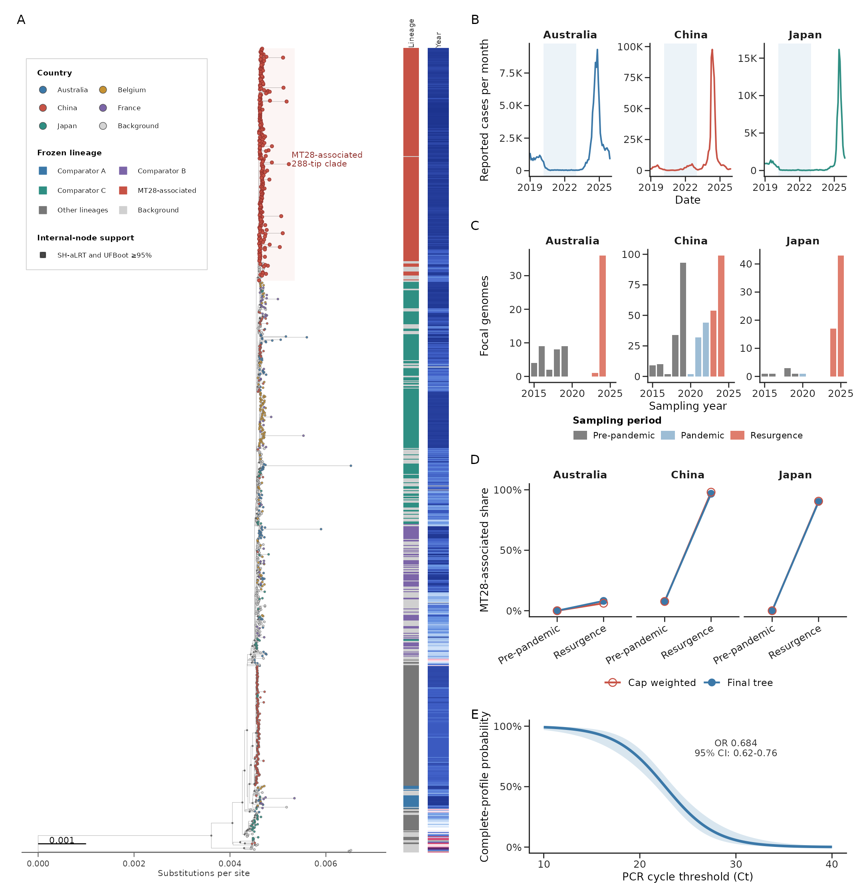
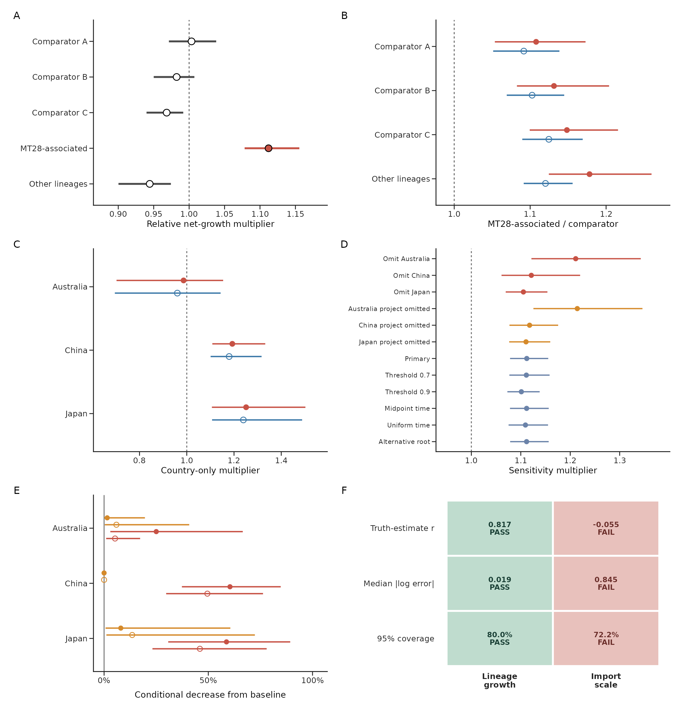

# Sampled ancestry and MT28-associated lineage expansion in pertussis resurgence

Public figures, source data, model summaries, and audit code for the *Journal of
Infection* Letter **"Sampled ancestry and MT28-associated lineage expansion in
post-pandemic pertussis resurgence."**

The old long-form package is preserved at
[`v1.0.0`](https://github.com/xmusphlkg/pertussis-genomic-transmission-public/tree/v1.0.0).

## Quick Links

| Need | Start here |
|---|---|
| Read the result | [Figure 1](figures/letter/Figure_1_observation_structure.pdf), [Figure 2](figures/letter/Figure_2_growth_robustness.pdf) |
| Match claims to files | [LETTER_EVIDENCE_MAP.md](LETTER_EVIDENCE_MAP.md) |
| Get panel source data | [figures/source_data/](figures/source_data/) |
| Re-render figures | [scripts/figures/](scripts/figures/) |
| Check the package | `python3 scripts/qa/validate_public_package.py` |

## Result

A 989-genome core-SNP tree identified a 288-tip MT28-associated genomic lineage
containing all 99 source-published MT28-labelled tips. In the project-adjusted
model, this lineage had a relative net-growth multiplier of 1.112 (95% CrI
1.078-1.156). The signal remains in China-only and Japan-only fits, country and
dominant-project omissions, deterministic cohort-cap checks, and six input
refits; Australia alone is too sparse to be informative.

This is a sampled ancestry and relative-growth result. It does not estimate
national lineage prevalence, individual transmission links, causal contribution
to resurgence, biological fitness, or an identifiable import scale.
Project adjustment handles measured project enrichment among included genomes;
it does not recover missing acquisition or sequencing denominators.

## Figures

[](figures/letter/Figure_1_observation_structure.pdf)

[](figures/letter/Figure_2_growth_robustness.pdf)

Three supplementary figures are also in [figures/letter/](figures/letter/).

## Reproduce

```bash
Rscript scripts/figures/render_letter_figures.R
Rscript scripts/figures/render_letter_supplementary_figures.R
python3 scripts/qa/validate_public_package.py
python3 -m pytest -q
```

Large fitted Stan objects are excluded; frozen inputs, posterior summaries,
diagnostics, and checksums are included.

## Boundary

Public sequence and surveillance accessions are retained. The Australian
specimen-level sequencing-process table from Fong et al. (2026) is not
redistributed; only aggregate calibration outputs used by the Letter are
included. Per-record Ct values, source-specific aliases, specimen types,
profile-success fields, and article-supplied marker annotations are removed
from released TSVs.

No repository-level licence has been assigned. Reuse remains subject to the
original third-party source terms.

## Citation

Use [CITATION.cff](CITATION.cff) and see [CHANGELOG.md](CHANGELOG.md) for the
transition from the long-form package to this Letter-first design.
